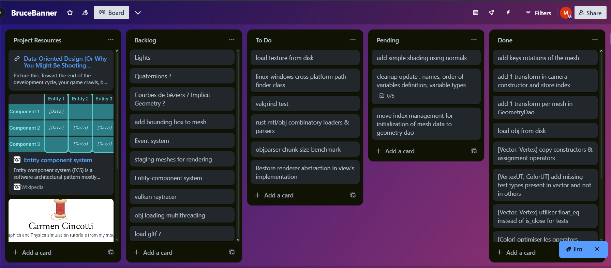
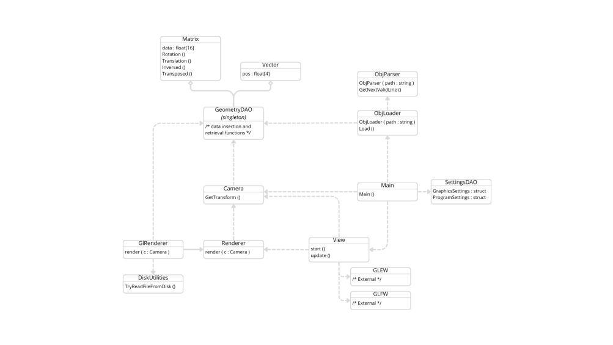
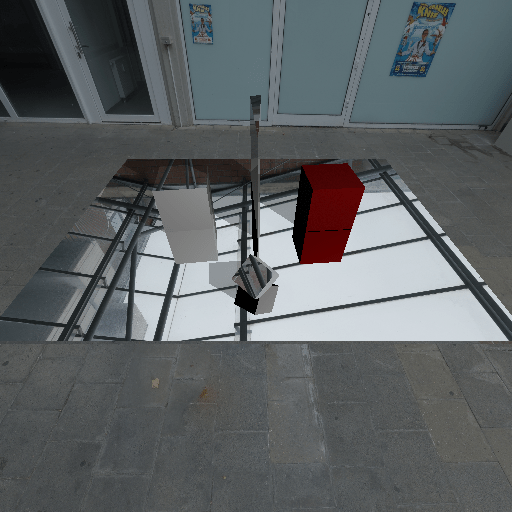
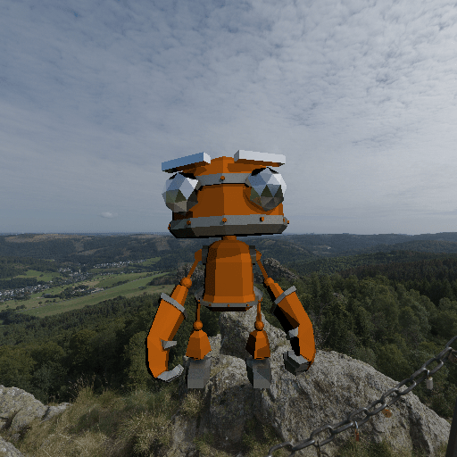

# Rendering software - Summer 2024

Currently, this software functions as an OBJ loader and an OpenGL renderer. The goal is to evolve it into a small game engine,
incorporating the extensions detailed below. This project aims to demonstrate the range of graphics and software architecture skills
I have developed through my academic curriculum and personal exploration.

To date, I have invested approximately 30 hours into this project, including significant pre-planning and research, 
as this is my first data-oriented project in C++. The project began with no pre-existing code. 
So far, I have utilized GLFW and GLEW for window management. Stb-image has been used for prototyping and may be employed for texture loading in the future.

## Project management

As the sole contributor to this project, I have established a basic workflow to efficiently track and manage tasks.

I am utilizing a Trello board to organize and monitor progress. To ensure code quality, I am using the Google Test framework and assertions to test features as they are implemented.

Additionally, I plan to integrate static analysis tools such as SonarQube once the initial version of the project is complete.

## work done

Here is a rudimentary class diagram of the current state of the project :

In summary, data from OBJ files is loaded using the ObjLoader and ObjParser classes into the Geometry Data Access Object, 
which is responsible for holding the mesh data. The View class manages the window and displays the output of the renderer attached to it.

## Planned work

I have not set any deadline for this project, but I aim to implement most of the following features to a satisfactory level within 200 hours of work time.

The immediate next features planned for this project include :
- Rewriting and enhancing the OBJ loader and parser in Rust : this will provide an opportunity to improve my knowledge of Rust and learn how to interface different parts of a program written in different languages.
- Finalizing the OpenGL renderer : this will include implementing textures, materials, and shadows with decent quality and performance.
- Event system : this will provide a clean and efficient way to pass instructions throughout the program and handle input.
- Entity-Component architecture : implementing this structure will enhance the modularity and flexibility of the system.

Later extensions include :
- Terrain generation : this is a topic I practiced during university that I would like to explore further.
- Network module in Rust, as I have been wanting to give Rust networking a try.
- Vulkan raytracer : this will be swappable in the app's settings at runtime and based on the CPU raytracer I have made previously.

here are some results I got with my former raytracer :

  
  

